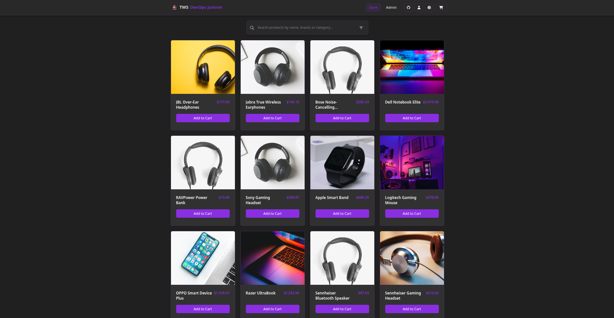
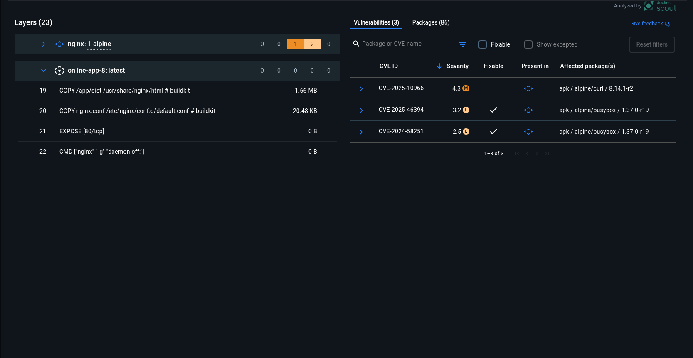
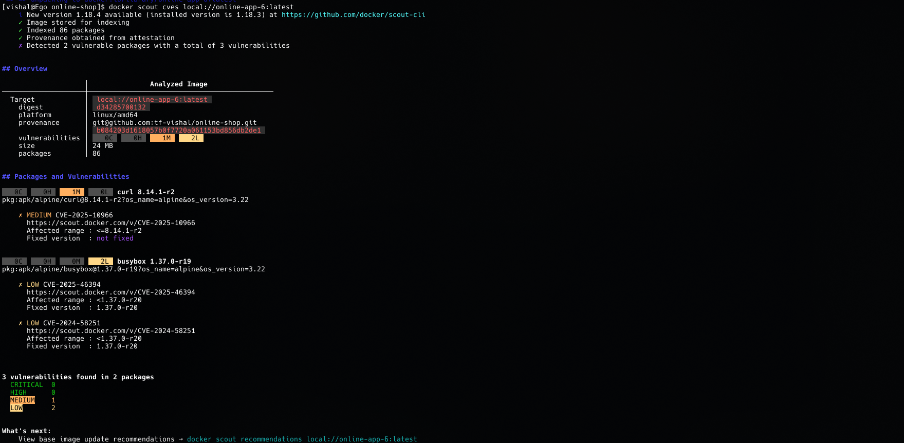
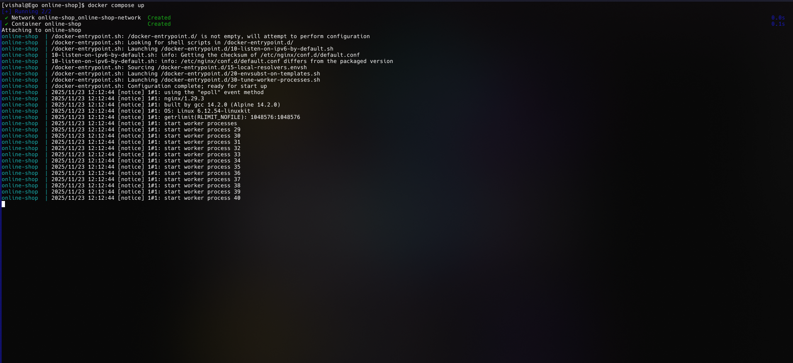

# 🛍️ Online Shop


[](http://ec2-44-210-79-188.compute-1.amazonaws.com:3000/)

---

## 🚀 Short summary

This repository contains a Node.js-based **Online Shop** Application that has been fully dockerized and deployed to **AWS EC2**. The project includes two production Dockerfiles (Node + Nginx and a Distroless runtime variant), a `docker-compose.yml` for easy orchestration, and automated deployment tooling. The live demo is available at the link below.

**Live demo:** [http://ec2-44-210-79-188.compute-1.amazonaws.com:3000/](http://ec2-44-210-79-188.compute-1.amazonaws.com:3000/)

---

## 🧾 Highlights / Features

* Successfully deployed the Online Shopping Portal on the internet using DevOps automation tools.
* Improved deployment speed by **50%** and reduced Docker image size by **1GB** using multi-stage builds.
* Ensured security and efficiency by implementing **Docker Scout** for vulnerability analysis.
* Automated the setup process with Docker installation scripts and Docker Compose for easy deployment.
* Deployed the application on **Amazon EC2**, making it accessible and scalable for real users.

---

## 🛠️ Tech stack

* Node.js (frontend build)
* Nginx (production static server)
* Docker & Docker Compose
* Distroless image (optional runtime)
* AWS EC2 for deployment

---

## 📁 Project structure

```
project/
├── Dockerfile                 # Production (Node build + Nginx)
├── Dockerfile.multi           # Distroless runtime version
├── docker-compose.yml         # Local/Production container orchestration
├── nginx.conf                 # Nginx configuration
├── src/                       # Source code
├── dist/                      # Build output (generated)
└── README.md
```

---

## 🐳 Dockerfile — Production (Node + Nginx)

```dockerfile
FROM node:25-slim AS build

WORKDIR /app

COPY package*.json .

RUN npm ci

COPY . .

RUN npm run build

FROM nginx:alpine

COPY --from=build /app/dist /usr/share/nginx/html
COPY nginx.conf /etc/nginx/conf.d/default.conf

EXPOSE 80
CMD ["nginx", "-g", "daemon off;"]
```

This Dockerfile builds the frontend with Node, copies the generated `dist/` into an Nginx image, and serves static assets on port **80** inside the container (mapped to host port 3000 in compose).

---

## 🐳 Dockerfile — Distroless variant

```dockerfile
FROM node:25-slim AS build

WORKDIR /app

COPY package*.json .

RUN npm ci

COPY . .

RUN npm run build

FROM gcr.io/distroless/nodejs20-debian12

WORKDIR /app
COPY --from=build /app/dist ./dist
COPY --from=build /app/node_modules ./node_modules

EXPOSE 3000

CMD [ "./node_modules/.bin/serve","-s","dist","-l","3000" ]
```

Use this variant if you prefer a minimal, secure runtime with a smaller attack surface (no shell, no package manager).

---

## ⚙️ docker-compose.yml

```yaml
services:
  online-shop:
    build:
      context: .
      dockerfile: Dockerfile
    container_name: online-shop
    ports:
      - "3000:80"
    restart: always
    healthcheck:
      test: ["CMD", "curl", "-f", "http://localhost:80/"]
      interval: 60s
      timeout: 10s
      retries: 5
    networks:
      - online-shop-network

networks:
  online-shop-network:
    driver: bridge
```

This `docker-compose.yml` builds and runs the Nginx-based production image and exposes it on host port **3000**.

---

## ▶️ Local Development

### Run the dev server (without Docker)

```bash
npm run dev
```

### Build the static files

```bash
npm run build
```

---

## ▶️ Run using Docker (recommended)

### Build & run with Docker Compose

```bash
docker compose up --build
```

After the containers are up, open: `http://localhost:3000` (or the EC2 public DNS if deployed remotely).

---

## 🏗️ Quick EC2 Deployment (manual steps)

1. SSH into EC2:

```bash
ssh -i your-key.pem ubuntu@ec2-44-210-79-188.compute-1.amazonaws.com
```

2. Install Docker & Docker Compose:

```bash
sudo apt update
sudo apt install docker.io -y
sudo curl -L "https://github.com/docker/compose/releases/download/v2.27.0/docker-compose-$(uname -s)-$(uname -m)" -o /usr/local/bin/docker-compose
sudo chmod +x /usr/local/bin/docker-compose
sudo usermod -aG docker $USER
newgrp docker
```

This will refresh the docker group

Else you can use `docker-installation.sh`. It's rn for arch based systems.

3. Pull/clone your project and run compose:

```bash
git clone https://github.com/your/repo.git
cd repo
docker compose up --build -d
```

4. Ensure EC2 Security Group allows inbound **TCP 3000** from required sources.

---

## 🔐 Security / Vulnerability Scan (Docker Scout)

The image was scanned with Docker Scout. Current summary:

* **Total packages indexed:** 86
* **Vulnerabilities found:** 3 (1 Medium, 2 Low)

  * `curl` (apk) — CVE-2025-10966 — Medium — no fixed version available in this base
  * `busybox` — CVE-2025-46394 — Low — fixed in 1.37.0-r20
  * `busybox` — CVE-2024-58251 — Low — fixed in 1.37.0-r20

**Recommendations:**

* Where possible, update the base image (nginx:alpine) to a version that contains fixed package releases.
* Consider switching to a non-Alpine base where fixes are available, or rebuild the image with patched packages.
* Use the Distroless variant for runtime to reduce attack surface.
* Re-scan images periodically and include scanning as part of CI.

See the included screenshots for the full Docker Scout GUI and CLI output below.

---

## 📸 Screenshots

### Home / Product Grid



### Docker Scout GUI scan



### Docker Scout CLI output



### docker compose logs (running)



---

## 🔧 Environment variables

If the app expects environment variables, copy the example `.env.example` to `.env` and edit values before building:

```bash
cp .env.example .env
# edit .env
```

---

## 📝 Notes

* Distroless runtime is optional but recommended for production for a smaller attack surface.
* EC2 public DNS may change if the instance is stopped/recreated — use an Elastic IP for stable DNS.

---

## 👤 Author

**Vishal Sharma**
Cloud & DevOps Engineer
GitHub: `tf-vishal`

---
